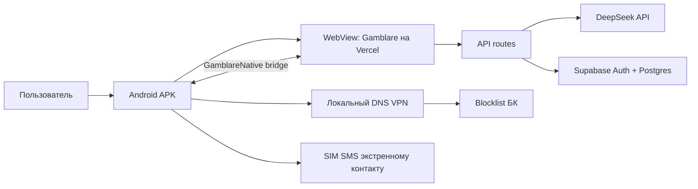

-----------


# Gamblare

Gamblare — хакатонный прототип для раннего обнаружения рискованного игрового поведения и поддержки людей, столкнувшихся с лудоманией в Казахстане.

Продукт объединяет Android-защиту от букмекерских сайтов, AI-чат, экстренный контакт и анонимное сообщество. Цель прототипа — заметить опасный момент до ставки, помочь человеку сделать паузу и при высоком риске связаться с выбранным близким.

Веб-демо: [gamblaregit.vercel.app](https://gamblaregit.vercel.app)

## Ключевые возможности

- **Gamblare-chat** — диалоговый AI-помощник на DeepSeek, который отвечает готовым текстом без вывода внутренних рассуждений.
- **Оценка риска** — сообщения дополнительно классифицируются локальными правилами как `low`, `medium` или `high`, поэтому критический сценарий не зависит только от формулировки модели.
- **Средний риск** — пользователь получает конкретное напоминание о самоограничении от азартных игр через eGov Mobile.
- **Высокий риск** — Android-приложение может отправить SMS выбранному экстренному контакту с SIM-карты телефона.
- **Мониторинг сайтов** — локальный Android VPN перехватывает обычные DNS-запросы и сравнивает домены со списком букмекерских сайтов.
- **Серия дней** — попытка открыть букмекерский сайт обнуляет текущий стрик.
- **Сообщество** — публикации, комментарии и лайки с хранением в Supabase; для презентации в ленте есть демо-посты.
- **Защита приложения** — Device Admin фиксирует попытку отключить защиту перед удалением приложения.
- **Профессиональная помощь** — кнопка открывает системный набор номера `150`.
- **Тёмная тема** и адаптивный мобильный интерфейс.

## Как используется AI

AI — центральная часть продукта, а не декоративный чат. Сервер передаёт DeepSeek последние сообщения диалога и задаёт стиль поддерживающего, взрослого и конкретного собеседника. Ответ должен:

1. Отразить смысл сообщения пользователя без осуждения.
2. Предложить один реалистичный шаг на ближайшие 10–20 минут.
3. Задать новый уместный вопрос, не повторяя предыдущую реплику.

Перед запросом к модели сервер отдельно ищет признаки потери контроля, желания поставить, попытки отыграться, долгов и эмоционального кризиса. При недоступности DeepSeek пользователь получает безопасный локальный ответ, соответствующий уровню риска. История авторизованного пользователя сохраняется в Supabase.

> Gamblare не ставит медицинский диагноз и не заменяет психолога или экстренную службу.

## Архитектура



Android-приложение является нативной оболочкой над веб-интерфейсом. JavaScript-мост связывает кнопки раздела «Защита» с нативными возможностями Android: VPN, SMS, стрик и Device Admin. API-ключ DeepSeek остаётся только на сервере и не попадает в APK или клиентский JavaScript.

## Структура проекта

```text
gamblare/
├── app/                 # мобильный web-интерфейс и API routes
├── android-app/         # нативная Android-оболочка, VPN, SMS и Device Admin
├── data/                # локальное JSON-хранилище для режима без Supabase
├── docs/                # дополнительная инструкция по Supabase
├── lib/                 # auth, Supabase и локальное хранилище
├── public/              # логотип и публичные ассеты
└── supabase/schema.sql  # таблицы, триггеры и RLS-политики
```

## Технологии

- React 19, TypeScript, Vinext/Vite
- Vercel/Nitro для web и API
- DeepSeek Chat API
- Supabase Auth и PostgreSQL с Row Level Security
- Android Java, `VpnService`, `SmsManager`, `DeviceAdminReceiver`, `WebView`

## Локальный запуск web

Требуется Node.js `22.13+`.

```bash
git clone https://github.com/dec1de0/gamblare.git
cd gamblare
npm install
cp .env.example .env.local
npm run dev
```

Приложение откроется на [localhost:3000](http://localhost:3000).

### Переменные окружения

```env
DEEPSEEK_API_KEY=your_deepseek_api_key
SUPABASE_URL=https://your-project.supabase.co
SUPABASE_ANON_KEY=your_supabase_anon_key
```

Не добавляйте `.env.local`, `service_role` или другие секретные ключи в Git. Без DeepSeek используется локальный fallback. Без Supabase приложение переключается на локальный JSON-файл; этот режим подходит только для локального демо и не обеспечивает постоянное хранение на Vercel.

## Настройка Supabase

1. Создайте проект в Supabase.
2. Откройте **SQL Editor** и выполните [supabase/schema.sql](supabase/schema.sql).
3. Для быстрого демо отключите **Confirm email** в `Authentication → Providers → Email`.
4. Добавьте `SUPABASE_URL` и `SUPABASE_ANON_KEY` в `.env.local` и Vercel.
5. Зарегистрируйте демонстрационного пользователя через интерфейс приложения.

Схема создаёт профили, посты, лайки, комментарии, экстренные контакты и историю AI-чата. RLS разрешает пользователю изменять только принадлежащие ему данные. Подробности находятся в [docs/supabase-setup.md](docs/supabase-setup.md).

## Деплой на Vercel

В Vercel импортируется корень репозитория `gamblare`, то есть папка с `package.json`, `app`, `public` и `vite.config.ts`.

- Build Command: `npm run build:vercel`
- Environment Variables: `DEEPSEEK_API_KEY`, `SUPABASE_URL`, `SUPABASE_ANON_KEY`
- Production URL текущего APK: `https://gamblaregit.vercel.app/`

После push в ветку `main` Vercel автоматически запускает новый деплой. APK загружает веб-версию по этому адресу, поэтому изменения интерфейса не требуют пересборки APK. Изменения VPN, SMS, разрешений или JavaScript-моста требуют новой Android-сборки.

## Сборка Android APK

Требуются Android SDK 35, JDK 17 и Gradle 8.9. Откройте папку `android-app` как отдельный проект в Android Studio либо выполните:

```bash
cd android-app
gradle assembleDebug
```

Результат:

```text
android-app/app/build/outputs/apk/debug/app-debug.apk
```

Debug APK подписывается стандартным отладочным сертификатом и предназначен для демонстрации, а не для публикации в Google Play.

### Разрешения Android

При первом чистом запуске запросы показываются последовательно:

1. Уведомления — Android 13 и новее.
2. Отправка SMS.
3. Активация Device Admin для фиксации попытки отключения защиты.
4. VPN-согласие — только после включения фильтра сайтов.

Android сохраняет решения о разрешениях при установке новой версии поверх старой. Для проверки полного onboarding удалите предыдущую сборку Gamblare или очистите данные приложения, затем установите новый APK.

## Демо-сценарий

1. Зарегистрироваться и добавить номер экстренного контакта.
2. Разрешить уведомления, SMS и Device Admin.
3. В разделе «Защита» включить фильтр сайтов и подтвердить VPN.
4. Открыть домен из `WebsiteBlocklist.java` в браузере телефона.
5. Показать блокировку, локальное уведомление, SMS контакту и обнуление стрика.
6. Открыть Gamblare-chat и отправить: `У меня ломка, кажется буду ставить`.
7. Показать высокий риск и SMS, затем открыть сообщество и создать пост/комментарий.

Повторные сигналы имеют cooldown, чтобы презентация не превратилась в неконтролируемую рассылку SMS.

## Ограничения прототипа

- DNS-фильтр не анализирует содержимое HTTPS и может не увидеть домен из браузерного кэша, Private DNS или DNS-over-HTTPS.
- После полного удаления APK Android больше не запускает его код. Прототип фиксирует запрос на отключение Device Admin перед удалением, но не может гарантированно отправить событие после завершённой деинсталляции.
- SIM SMS зависит от наличия SIM-карты, баланса/тарифа и разрешения `SEND_SMS`. Публикация такого приложения в Google Play потребует отдельного обоснования использования SMS-разрешения.
- AI-классификация предназначена для поддержки и демонстрации, а не для клинической диагностики.
- Внутренний Android `applicationId` пока сохранён как `kz.hackathon.ludoguard`, чтобы обновления устанавливались поверх предыдущих тестовых сборок. Пользовательское название приложения — Gamblare.

## Проверка перед коммитом

```bash
npm run lint
npm run build:vercel
```

Для Android дополнительно выполните `gradle assembleDebug` из папки `android-app`.
